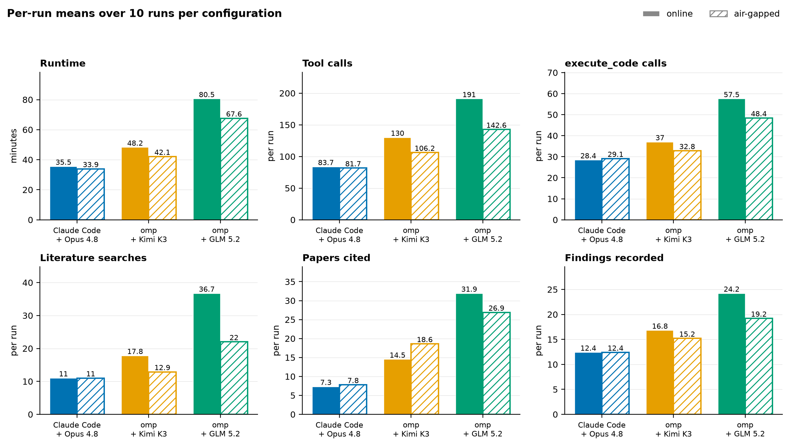
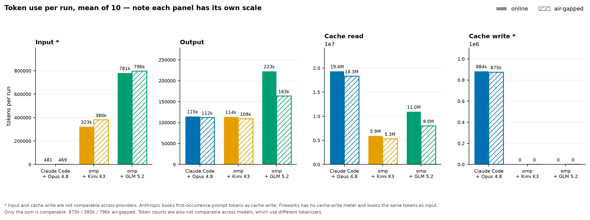
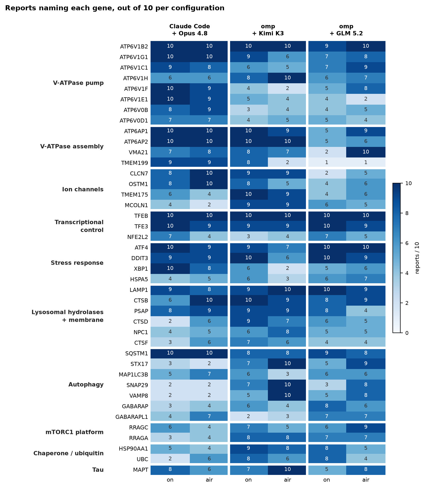

Sixty runs: two open-weight models (Kimi K3, GLM 5.2) and one frontier model (Opus 4.8), each given the same Alzheimer's dataset and question through [OpenScientist](https://openscientist.io) 10 times — online, then behind a full air gap.

The question came from Mathieu Bourdenx, verbatim:

> This is a single soma transcriptomic dataset of tangle-bearing and tangle-free neurons. Compare healthy to diseased neurons to investigate how is the proteostasis network rewired with the appearance of tau pathology. Investigate in particular if lysosomal acidification is changing.

The data is `OteroGarcia_excitatory_subset.h5ad` — 22,492 single neurons × 33,091 genes from 8 Braak VI donors, split by `obs.SORT` into **AT8** (tangle-bearing, 13,864) and **MAP2** (tangle-free, 8,628). Note there is no non-AD control arm: "healthy" means tangle-free *within* end-stage disease.

Two variables, 10 repeats each:

- **Three model/harness pairs** — Claude Code + Opus 4.8, omp + Kimi K3, omp + GLM 5.2
- **Two network modes** — online, and fully **air-gapped**: nftables `policy drop`, DNS narrowed to the container's own resolver, egress only to a local LLM proxy and execution broker, and literature served from a local 40M-article MEDLINE mirror instead of NCBI

Every run got 10 iterations. All 60 completed. No failures.

**Inference is the one carved-out exception.** The agent container has no route to the internet — the data, the code execution and the literature search are all local. Model inference is the single permitted egress, forwarded by the local proxy to a trusted API: here Azure AI Foundry, which also holds the credential the container never sees. Kimi K3 and GLM 5.2 are open-weight, so for those two this is a deployment choice rather than a dependency — it moves on-prem as soon as we source inference hardware, with nothing else about the setup changing. Opus 4.8 is hosted and would still need the exception.

---

## 1. Run statistics

**Air-gapped is faster** — 5% to 16% — for all three. The likely cause is unglamorous: a local Postgres full-text index answers in 0.05–0.4 s where NCBI round-trips take seconds, and these runs make 11–37 literature calls each.

**GLM does the most work by a wide margin** — roughly twice Opus's tool calls and code executions, and three times its literature searches — which is where its longer runtime goes.

### Tokens

Cache reads dominate everything, because an agent loop re-sends its whole conversation each turn. For Claude Code + Opus that is 94% of all tokens.

Air-gapped uses slightly **fewer** tokens across the board — the same pattern as runtime, and for the same reason: fewer, cheaper literature round-trips.

**Input and cache write are shown as one bar** because they are the same quantity metered two ways: Anthropic books a prompt token's first occurrence as *cache write*, Fireworks has no cache-write meter and books it as *input*. Split apart they imply Claude Code + Opus sends a 469-token prompt, which is an artefact of the meter rather than a fact about the model. The shading shows which meter each provider used — Opus books 884k of its 885k prompt tokens as cache write; both omp configs book all of theirs as input.

Counts are still **not comparable across models**, which use different tokenizers. The useful comparison is within a model, between modes.

---

## 2. Scientific content

Three criteria, taken from the three clauses of the question, scored per run and broken out by configuration.

| | | C1 | C2 | C3 | FDR | donor-aware |
|---|---|---|---|---|---|---|
| **Claude Code + Opus 4.8** | online | 10/10 | 10/10 | 10/10 | 10/10 | 10/10 |
| | air-gapped | 10/10 | 10/10 | 10/10 | 10/10 | 10/10 |
| **omp + Kimi K3** | online | 10/10 | 10/10 | 10/10 | 10/10 | 10/10 |
| | air-gapped | 10/10 | 10/10 | 10/10 | 10/10 | 10/10 |
| **omp + GLM 5.2** | online | 10/10 | 10/10 | 10/10 | **8/10** | 10/10 |
| | air-gapped | 10/10 | 10/10 | 10/10 | **9/10** | 10/10 |

- **C1** — compares AT8 (tangle-bearing) against MAP2 (tangle-free) neurons
- **C2** — characterises how the proteostasis network is rewired, naming at least two arms
- **C3** — addresses lysosomal acidification specifically
- **FDR** — corrects for multiple testing
- **donor-aware** — treats the 8 donors as the sample size rather than the 22,492 cells, by pairing or pseudobulk. Neurons from one donor are not independent observations, and ignoring that turns 8 biological replicates into 22,492 fake ones.

**Twenty-eight of these thirty cells are 10/10.** The only variation anywhere is GLM's multiple-testing correction, which it omitted in two online runs and one air-gapped run. Every configuration addressed every part of the question in every run, in both network modes.

C3 was the one we expected runs to drop — it is the narrowest clause, and easy to gloss over while writing broadly about proteostasis. None did.

### The genes

Symbols are counted against the dataset's own 33,091 gene names, so a token only counts if it is a gene the experiment actually measured. Genes the dataset sorts cells by (`MAP2`, `CUX2`, `LAMP5`) are excluded as bookkeeping.

Every configuration lands on the same machinery: the V-ATPase pump and the factors that assemble it, the TFEB/TFE3 transcriptional axis, the integrated stress response, lysosomal hydrolases, autophagy, and the counter-ion channels the pump depends on.

Transcriptional control leads: TFEB appears in all 60 reports, TFE3 in 56. The disagreement collects in autophagy, the ion channels and pump assembly, where a gene can be near-universal for one model and nearly absent for another — Opus is thorough on the pump itself (ATP6V1F 19/20, ATP6V1E1 19/20) and barely touches autophagosome–lysosome fusion (SNAP29 4/20, VAMP8 4/20), while Kimi is the reverse (SNAP29 17/20, VAMP8 15/20, ATP6V1F 6/20). Within a model, the online and air-gapped columns track each other closely.

### The finding that replicates

Every run agrees on the observation: **the V-ATPase proton pump and its assembly machinery are transcriptionally upregulated in tangle-bearing neurons** relative to tangle-free neurons from the same donor — coordinated across the V0 and V1 sectors, the ER assembly factors (ATP6AP1/2, VMA21) and the chloride counter-ion channels (CLCN7, OSTM1). The wider proteostasis network moves the same way, but unevenly: chaperone and lysosomal arms move most, proteasome and autophagy lag.

### The interpretation that doesn't

Whether that upregulation means acidification actually *increases*, or is a futile response to a pump failing downstream, does not replicate:

| | reads as increased | reads as impaired |
|---|---|---|
| Claude Code + Opus 4.8 | 4 | 4 |
| omp + Kimi K3 | 3 | 3 |
| **omp + GLM 5.2** | 3 | **7** |

Same data, same prompt, ten runs each. **omp + GLM leans systematically toward futile compensation; the other two split evenly.** For anyone planning to run this once, that is the result: the measurement is reproducible, the conclusion is not.

### One hypothesis worth following

All three configurations name **ATP6V1H** — the V1 peripheral-stalk subunit that couples V1 to V0 — as selectively downregulated (43 of 60 reports), and the omp runs go further and propose it as *why* pump upregulation fails to deliver acidification. Nobody prompted for it. It is specific, mechanistic, and testable.

---

## Caveats

- **These are unreviewed machine outputs.** No human scientist has checked them.
- **Criteria C1–C3 are keyword-based.** They establish a topic was addressed, not that it was addressed correctly. Reported cell counts were separately checked against ground truth: 59 of 60 accurate.
- **Gene mentions are token matches.** A gene named once in passing counts the same as one a report is built around, and matching is case-sensitive against the dataset vocabulary.
- **n = 10 per cell.** Enough to see the interpretation split; not enough to rank models on quality.

Full provenance — prompt checksum, data md5, image digests, per-run job IDs — is kept with the runs. Software: OpenScientist at `5a310f6`, claude-agent-sdk 0.2.136 (Claude Code CLI 2.1.228), omp 17.1.5, scanpy 1.12, on Azure AI Foundry.
